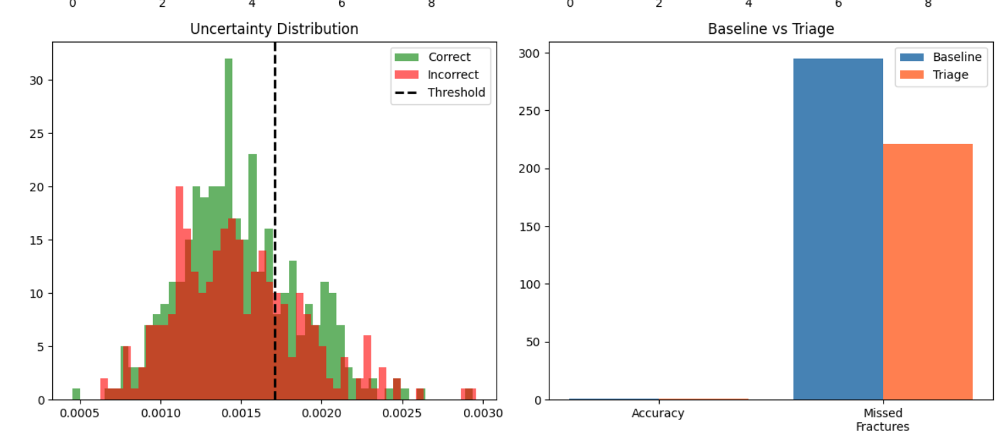

# 🩻 Uncertainty-Aware Wrist Fracture Detection using Deep Learning

## 📌 Overview

This project presents an **Uncertainty-Aware Wrist Fracture Detection System** using Deep Learning on the **MURA (Musculoskeletal Radiographs) Dataset**, specifically focusing on **XR_WRIST** images.

The model uses a **ResNet-50 based architecture** for binary classification (**Fracture / Normal**) and improves clinical reliability using:

- Monte Carlo Dropout
- Predictive Uncertainty Estimation
- Uncertainty-Aware Triage System
- Calibration Analysis (ECE)
- Performance Visualization

Instead of forcing predictions on uncertain cases, the system intelligently recommends **CT/MRI referral**, making it safer and more practical for real-world healthcare applications.

---

## 🚀 Key Features

- Binary Wrist Fracture Classification
- ResNet-50 Transfer Learning
- Monte Carlo Dropout for Uncertainty Estimation
- Smart Triage System for High-Uncertainty Cases
- Expected Calibration Error (ECE)
- AUROC Performance Evaluation
- Clinical Decision Support Framework

---

## 📂 Dataset Used

### MURA Dataset

**MURA (Musculoskeletal Radiographs Dataset)** is one of the largest public datasets for bone abnormality detection.

### Subset Used

XR_WRIST

### Label Mapping

- positive → Fracture
- negative → Normal

---

## 🧠 Model Architecture

### Backbone

ResNet-50 (Pretrained)

### Classification Head

- Dropout(0.5)
- Fully Connected Layer → 2 Classes

The dropout layer improves generalization and enables Monte Carlo Dropout during inference.

---

## 🔬 Workflow

Data Preprocessing  
↓  
ResNet-50 Training  
↓  
Validation & Testing  
↓  
MC Dropout Inference  
↓  
Uncertainty Estimation  
↓  
Triage Decision System  
↓  
Calibration Analysis  
↓  
Clinical Reliability Evaluation

---

## 📊 Evaluation Metrics

### Performance Metrics

- Accuracy
- Validation Loss
- AUROC Score

### Reliability Metrics

- Predictive Variance
- Confidence Score
- Expected Calibration Error (ECE)

### Clinical Metrics

- Deferred Cases
- Diagnosed Cases
- Triage Accuracy

---

## 📈 Visualizations

The project includes:

- Training vs Validation Loss Curves
- Confidence Distribution
- Uncertainty Distribution
- Calibration Analysis
- Triage Performance Summary

---

## 🛠️ Tech Stack

- Python
- PyTorch
- Torchvision
- NumPy
- Pandas
- Matplotlib
- Scikit-learn
- PIL
- tqdm

---

## 🎯 Clinical Significance

Conventional AI systems make forced predictions even when confidence is low.

This project introduces a **Safe AI Framework for Healthcare**, where uncertain predictions are escalated for specialist review instead of risking false diagnosis.

This improves:

- Patient Safety
- Clinical Trust
- AI Reliability
- Decision Support Quality

---

## 📌 Future Scope

- Vision Transformers (ViT)
- Grad-CAM Explainability
- Ensemble Learning
- Streamlit Deployment
- Hospital PACS Integration

---

## 📄 Research Publication

This work was presented as a research paper at:

## ICEOI Conference 2026

### Presented By

- Siddharth Venkatesh
- Hardik Agarwal
- Ekagra Mishra
- Dr.Suresh Annamalai
---

---

## ⭐ Support

If you found this project valuable, please consider giving this repository a ⭐ on GitHub.

---
